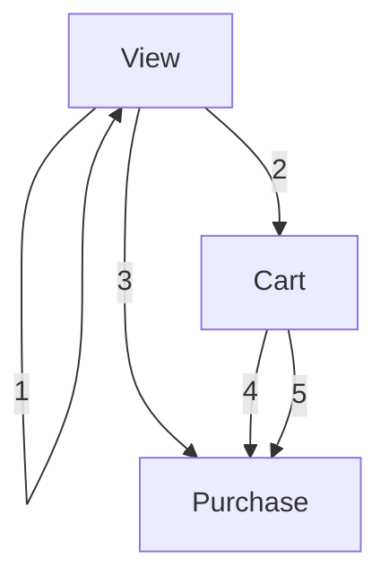

# Commerce_Purchase_Behavior_Prediction
[추천시스템]  커머스 상품 구매 예측

## Summary

### 🛠️ 문제 정의

- **목표**: 온라인 스토어 유저의 다음 1주일 이내 구매할 상품 예측 및 쇼핑 패턴 분석

### ⚙️ 수행 역할
-	구매 유형 기반 전환 경로(Conversion Path) 정의
-	Sequential 추천 모델(SASRec)과 일반 모델(ALS) 성능 차이 확인
-	구매 이벤트에 대한 데이터 불균형 완화를 위한 데이터 증강 및 Negative Sampling 기법 적용
-	LB 확인 방법 외에 로컬에서 모델 성능을 평가할 수 있는 메커니즘 도입하여 효율적인 성능 평가 구현

### 📈 결과 및 직무에 적용할 점
- 추천 시스템의 불균형 문제 해결을 위한 다양한 방법론 활용
- 데이터 전처리를 통해 Positive Sample과 Uninteresting Items 개념 도입으로 소비자 쇼핑 패턴 심층 분석

  

$${\color{gray}(※ 아래는 프로젝트의 상세 내용 입니다.)}$$
## 상세

### 📝 데이터 수집
* **데이터셋 설명**
  - 온라인 스토어 유저의 행동 데이터
  - 유저, 아이템, 이벤트 정보(구매, 카트에 넣기, 조회), 아이템 브랜드, 아이템 가격 정보
  - **Train data**
    - 2019.11.01 - 2020.02.29  → 4개월 간의 데이터(8,350,311 건)
  - **Test data**
    - 2020.03.01 - 2020.03.07 → Train data 기간 이후 일주일 간의 데이터

   

     
    

   

---

### 🔍 📊 데이터 전처리 & EDA
#### 1. Conversion Path 정의
- Event_Type(View, Cart, Purchase)을 기준으로 총 5가지의 path로 사용자마다 특정 아이템의 이벤트 발생 여부 및 
전환 경로 정의
- **🚩Conversion Paths**

 | 번호 | 경로                          |
 | ---- | ----------------------------- |
 | 1    | **View only**                |
 | 2    | **View → Cart**              |
 | 3    | **View → Purchase**          |
 | 4    | **View → Cart → Purchase**   |
 | 5    | **Cart → Purchase**          |

- 실제 구매까지의 거래가 매우 적음
  - 상품을 보기만한 이벤트(view_only)가 전체 99.86%
  - 전환이 발생했다고 하더라도 구매(purchase)까지 이어진 경우는 1212건으로 전체의 
0.002%로 매우 낮음

  

   

  

#### 2. Cold Start Item
  - 각 아이템마다 사용자와의 상호작용이 얼만큼 되는지 확인을 통해 상호작용이 적거나 없는(1회 이하) 아이템을 cold start 아이템으로 간주
  - Cold start Item이 전체 아이템의 0.08%로 매우 작음
  - Cold Start에 대한 영향은 크지 않은 것으로 판단

---
### 🧠 모델링
#### 평가 지표
- **NDCG@10**
    * 각 유저마다 중복되지 않은 10개의 아이템을 추천
    * Binary Relevance 기반의 NDCG@10을 사용
    * relevance : [실제 구매 (1) | 구매하지 않음 (0)]
    * (+ 개념 설명)
      * NDCG(Normalized Discounted Cumulative Gain)는 정보 검색 시스템의 성능을 평가하는 지표로 추천된 아이템의 순위가 얼마나 관련성이 높은지를 측정
      * NDCG@10은 추천된 상위 10개의 아이템에 대해 계산되는데, 이 지표는 사용자에게 더 높은 순위에 있는 관련 아이템이 추천될수록 높은 점수를 부여

 
  추가 참고 자료: [NDCG란?](https://en.wikipedia.org/wiki/Discounted_cumulative_gain)

  
#### 모델 구성 및 학습
1. **Data Augmentation 적용**
2. **SASRec 모델에 Negative Sampling 도입**
